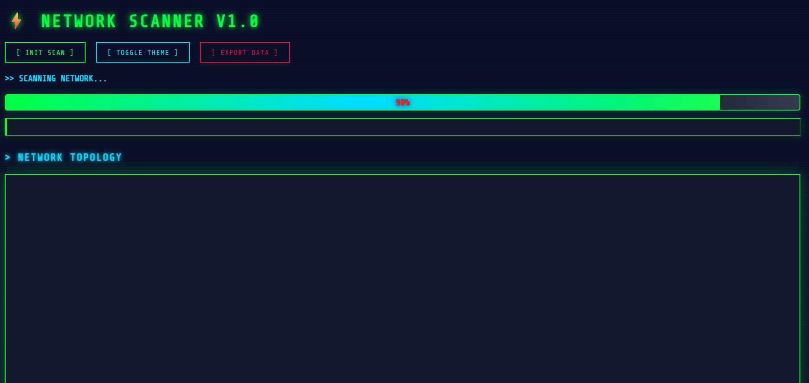
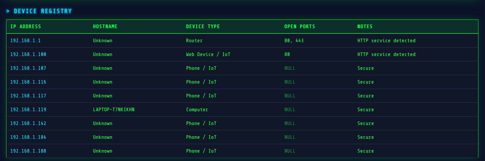
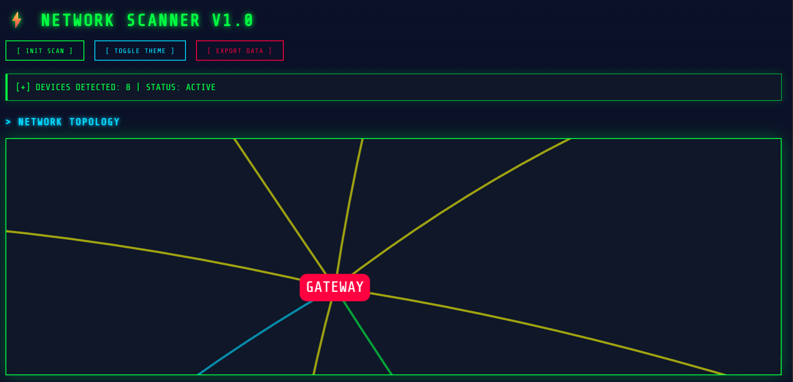

# 🛡️📡 Local Network Scanner & Visualization Tool


> 🧠 **Educational & Ethical Cybersecurity Project**
> Scan and visualize **your own local network** to understand devices, services, and basic security exposure.

---

## 🕵️‍♂️🔍 Project Overview

A **Python-based local network scanner** with a **modern web dashboard** that:

* Discovers devices on a LAN
* Identifies open services
* Classifies device types
* Visualizes the network topology
* Presents results in a clean cybersecurity-style UI

⚠️ **Use only on networks you own or have permission to scan**

---

## 🖼️📸 Screenshots

> 📌 Add screenshots inside a `/screenshots` folder

```
screenshots/
├── dashboard.png
├── dark-mode.png
├── network-diagram.png
```

```md



```

---

## ✨🛠️ Features

### 🔍 **Network Discovery**

* 📡 ICMP-based device detection
* 🔌 Safe TCP port scanning (common ports)
* 🏷️ Hostname resolution

### 🧠 **Device Intelligence**

* 🖥️ Computer / 📱 Phone / 🌐 IoT / 🛜 Router detection
* ⚠️ Basic security observations
* 🔐 Non-intrusive analysis only

### 🌐 **Web Dashboard**

* 🔄 Refresh / re-scan button
* ⏳ Loading indicator
* 📊 Device count statistics
* 🌙 Dark mode toggle
* 📤 Export scan results (JSON)
* 🗺️ Interactive network diagram

### 📊 **Visualization**

* 🛜 Router-centered topology
* 🎨 Color-coded device nodes
* 🔍 Zoom & drag interaction

---

## 🖥️⚙️ Tech Stack

| 🔧 Component      | 🧪 Technology                 |
| ----------------- | ----------------------------- |
| 🐍 Language       | Python 3                      |
| 🌐 Backend        | Flask                         |
| 📡 Networking     | socket, subprocess, ipaddress |
| 🎨 Frontend       | HTML, CSS, JavaScript         |
| 🗺️ Visualization | vis-network                   |
| 📄 Output         | Web UI, JSON                  |

---

## 📁🗂️ Project Structure

```
net-scanner/
├── discovery.py        # ICMP discovery
├── port_scan.py        # Port scanning
├── hostname.py         # Hostname lookup
├── device_type.py      # Device classification
├── risk_check.py       # Security notes
├── scanner.py          # CLI scanner
├── web_app.py          # Flask web app
├── templates/
│   └── index.html      # Dashboard UI
├── screenshots/
└── README.md
```

---

## 📥⬇️ Clone the Repository

```bash
git clone https://github.com/your-username/net-scanner.git
cd net-scanner
```

---

## ⚙️🧰 Setup Instructions

### 🧪 1️⃣ Create Virtual Environment (Recommended)

**Windows**

```bash
python -m venv venv
venv\Scripts\activate
```

**Linux / macOS**

```bash
python3 -m venv venv
source venv/bin/activate
```

---

### 📦 2️⃣ Install Dependencies

```bash
pip install flask tabulate
```

---

## ▶️🚀 How to Run

### 🖥️ Option 1: CLI Scanner

```bash
python scanner.py
```

Expected output:

```
✔ Device found: 192.168.1.1
✔ Device found: 192.168.1.119
```

---

### 🌐 Option 2: Web Dashboard (Recommended)

```bash
python web_app.py
```

Open browser:

```
http://127.0.0.1:5000
```

---

## 🧪🧠 How to Test the Project

### ✅ Functional Test Checklist

| 🔍 Test        | ✅ Expected Result           |
| -------------- | --------------------------- |
| 🔄 Refresh     | Scan runs again             |
| ⏳ Loading      | Spinner appears             |
| 📊 Stats       | Device count updates        |
| 🌙 Dark Mode   | UI theme switches           |
| 📤 Export JSON | File downloads              |
| 🗺️ Diagram    | Devices visible & connected |

---

### 🛑 Common Issues

❌ **No devices found**

* Run terminal as administrator
* Ensure network connection
* Disable firewall temporarily (testing only)

❌ **Flask not found**

```bash
pip install flask
```

---

## 🧠🧬 How Device Detection Works

🔍 **Heuristic-based identification**:

* 🧭 IP patterns (e.g. `.1` → Router)
* 🏷️ Hostname keywords
* 🔌 Open ports
* 🌐 Service behavior

✅ No exploitation
✅ No brute force
✅ No sniffing

---

## 🔐⚖️ Security & Ethics

✔️ Defensive security only
✔️ Local network scanning
✔️ Educational purpose
✔️ No data interception

---

## 🎓📚 Learning Outcomes

* 🌐 TCP/IP & ICMP fundamentals
* 🔌 Service & port analysis
* 🛡️ Basic security awareness
* 🧩 Backend–frontend integration
* 🗺️ Network visualization

---

## 🛣️🚧 Future Improvements

* 🧬 MAC vendor detection
* 🕒 Scan history
* 🌍 Network segmentation
* 📄 CSV export
* 🐳 Docker support

---

## 📜📄 License

📘 Released for **educational use only**

---

## 🙌💙 Acknowledgements

Inspired by real-world **network discovery & security tools**, built for learning and portfolio demonstration.

